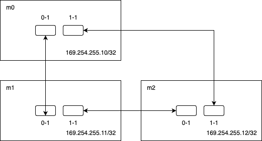

# Home Network Setup

Some notes on my current home network setup.

## Subnets

- `192.168.1.0/24` - LAN
- `192.168.33.0/24` - Wireguard
- `10.0.10.0/24` - IoT (VLAN10)
- `10.0.20.0/24` - Cilium LoadBalancer Pool
- `10.0.40.0/24` - Servers

## Cilium LoadBalancer & BGP

I use [Cilium](https://docs.cilium.io/en/stable/network/lb-ipam/) to support LoadBalancer services in the cluster. Cilium manages the `10.0.20.0/24` subnet for IP allocation. BGP is configured between Cilium and my UDM Pro to provide routing for the rest of my home network.

## ThunderBolt Ring Network

`169.254.255.0/24` is used for the ring network. Each node is connected to the other 2 nodes using the 2 thunderbolt ports on each computer.



### Validating Configuration

Spin up 3 node-shells:

```bash
task kubernetes:node-shell NODE=m0
task kubernetes:node-shell NODE=m1
task kubernetes:node-shell NODE=m2
```

Check routes are configured correctly:

```bash
ip r | grep '169.254.255'
```

Ping each node and make sure it works:

```bash
# From m0
ping 169.254.255.11
ping 169.254.255.12
# etc...
```
